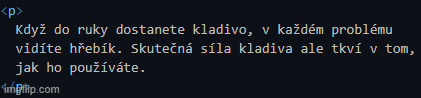

# helloworld README, oujé

Klíčová slova: *HTML*, *\&nbsp*, *zalamování českého textu*, *nezlomitelné mezery*

Entity pro nezlomitelné mezery (např. \&nbsp) se skládají nejméně z 5 znaků

Chcete správně zalamovat text v HTML dokumentech? Psaní nezlomitelných mezer nebo jejich entit stojí čas. Nástroj, který to dělá automaticky, tento čas ušetří. Tady je.

## Funkce

Napíšete text bez starostí se zalamováním, pak necháte typ každé mezery určit automaticky.

Podporované entity pro nezlomitelné mezery jsou: *\&nbsp;*, *\&#160;*, *\&#xA0;* a *\&#xa0;*
Podporován je také znak nezlomitelné mezery (alt + 0160).

Lepší program asi nenajdete, ale implicitní nastavení není dokonalé. Chování si však lze přizpůsobit pomocí regulárních výrazů.

> Tip: Many popular extensions utilize animations. This is an excellent way to show off your extension! We recommend short, focused animations that are easy to follow.

## Extension Settings

Toto rozšíření přináší nějaká nastavení...

Include if your extension adds any VS Code settings through the `contributes.configuration` extension point.

For example:

This extension contributes the following settings:

* `myExtension.enable`: Enable/disable this extension.
* `myExtension.thing`: Set to `blah` to do something.

## Známé problémy

Implicitní nastavení není dokonalé. Některá pravidla totiž bohužel nelze snadno a spolehlivě implementovat.

## Poznámky k verzím

Users appreciate release notes as you update your extension.

### 1.0.0

Initial release of ...

### 1.0.1

Fixed issue #.

### 1.1.0

Added features X, Y, and Z.

---

## Working with Markdown

You can author your README using Visual Studio Code. Here are some useful editor keyboard shortcuts:

* Split the editor (`Ctrl+\`).
* Toggle preview (`Shift+Ctrl+V`).
* Press `Ctrl+Space` to see a list of Markdown snippets.

## For more information

* [Visual Studio Code's Markdown Support](http://code.visualstudio.com/docs/languages/markdown)
* [Markdown Syntax Reference](https://help.github.com/articles/markdown-basics/)

**Enjoy!**
